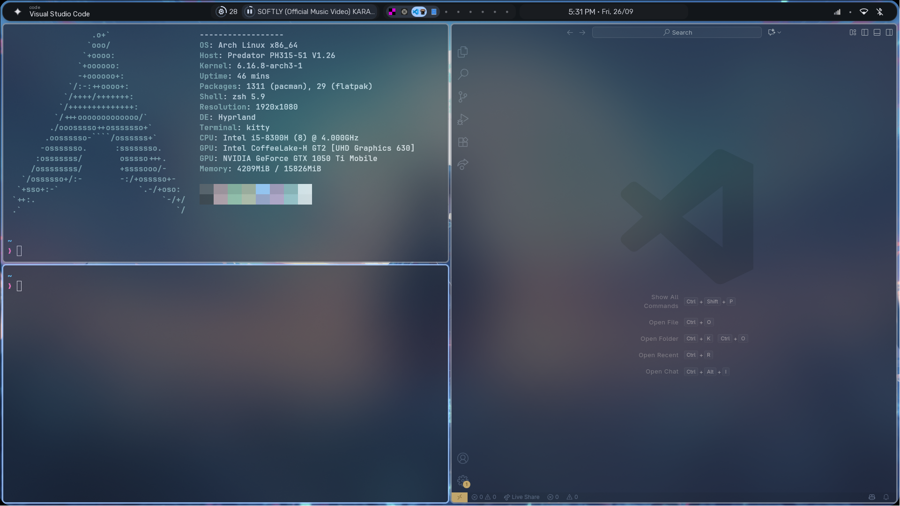

# Hyprland Config

A clean, modular configuration for [Hyprland](https://github.com/hyprwm/Hyprland) Wayland compositor.

## Features
- **Modular config:** Separate files for monitors, colors, keybinds, rules, plugins, and more (see `hypr/` directory)
- **Tiling layout:** Uses `dwindle` layout with adjustable gaps and borders
- **Custom keybinds:**
  - `SUPER + T` — Launch terminal (Kitty)
  - `SUPER + E` — Launch file manager (Dolphin)
  - `SUPER + Space` — App launcher (Rofi)
  - `SUPER + [1-0]` — Switch workspaces
  - `SUPER + SHIFT + [1-0]` — Move window to workspace
  - Media, volume, and brightness keys supported
- **Scripts:** Custom scripts for launcher, clipboard, powermenu, and more
- **Theming:** Centralized color and decoration management

## Screenshot

---

> Tweak configs in `hypr/userConfig/` to suit your workflow!
